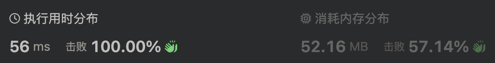

# 1351. 统计有序矩阵中的负数

给你一个 m \* n 的矩阵 grid，矩阵中的元素无论是按行还是按列，都以非严格递减顺序排列。 请你统计并返回 grid 中 负数 的数目。

示例 1：

> 输入：grid = [[4,3,2,-1],[3,2,1,-1],[1,1,-1,-2],[-1,-1,-2,-3]]
>
> 输出：8
>
> 解释：矩阵中共有 8 个负数。

示例 2：

> 输入：grid = [[3,2],[1,0]]
>
> 输出：0

提示：

- m == grid.length
- n == grid[i].length
- 1 <= m, n <= 100
- -100 <= grid[i][j] <= 100

进阶：你可以设计一个时间复杂度为 O(n + m) 的解决方案吗？

## 方法一：二分查找

对每一行进行二分查找，left 左边为正数，右边为负数


```ts
export function countNegatives1(grid: number[][]): number {
  function binarySearch(arr: number[]) {
    let left = 0,
      right = arr.length - 1;
    while (left <= right) {
      const mid = left + ((right - left) >> 1);
      if (arr[mid] >= 0) left = mid + 1;
      else right = mid - 1;
    }
    return left;
  }

  let count = 0;

  for (let i = 0; i < grid.length; i++) {
    const arr = grid[i];
    count += arr.length - binarySearch(arr);
  }

  return count;
}
```

由于数组按行按列都是非严格递减顺序排列，那么可以先找到第一列的负数部分，那么此行之后的行都是负数

感觉应该会少一部门的二分查找，然而 leetcode 的时间复杂度却不如直接逐行二分


```ts
function binarySearch(arr: number[]) {
  let left = 0,
    right = arr.length - 1;
  while (left <= right) {
    const mid = left + ((right - left) >> 1);
    if (arr[mid] >= 0) left = mid + 1;
    else right = mid - 1;
  }
  return left;
}

let m = grid.length,
  n = grid[0].length,
  count = 0;
const mid = binarySearch(grid.map((l) => l[0]));
count += (m - mid) * n;

for (let i = 0; i < mid; i++) {
  const arr = grid[i];
  count += arr.length - binarySearch(arr);
}

return count;
```

想着会不会是 grid.map 操作耗时，直接对原数组二分，反而更慢了


```ts
function countNegatives2(grid: number[][]): number {
  let count = 0;

  // 列
  let left = 0,
    right = grid.length - 1;
  while (left <= right) {
    const mid = left + ((right - left) >> 1);
    if (grid[mid][0] >= 0) left = mid + 1;
    else right = mid - 1;
  }
  count += (grid.length - left) * grid[0].length;

  // 行
  for (let i = 0; i < left; i++) {
    const arr = grid[i];
    let l = 0,
      r = arr.length - 1;
    while (l <= r) {
      const mid = l + ((r - l) >> 1);
      if (arr[mid] >= 0) l = mid + 1;
      else r = mid - 1;
    }
    count += arr.length - l;
  }

  return count;
}
```

## 方法二：倒着遍历+二分查找

由于数组按行按列都是非严格递减顺序排列，直接倒着遍历，如果 grid[i][0] < 0，那么此行全为负数，如果不是则二分查找



```ts
function countNegatives3(grid: number[][]): number {
  function binarySearch(arr: number[]) {
    let left = 0,
      right = arr.length - 1;
    while (left <= right) {
      const mid = left + ((right - left) >> 1);
      if (arr[mid] >= 0) left = mid + 1;
      else right = mid - 1;
    }
    return left;
  }

  let count = 0;
  let n = grid[0].length;

  for (let i = grid.length - 1; i >= 0; i--) {
    const arr = grid[i];
    if (arr[0] < 0) {
      count += n;
      continue;
    }
    count += n - binarySearch(arr);
  }

  return count;
}
```
