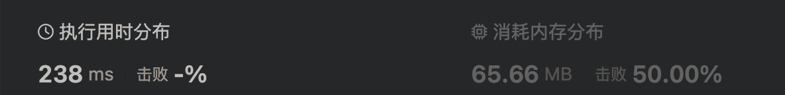

# 1838. 最高频元素的频数

元素的 频数 是该元素在一个数组中出现的次数。

给你一个整数数组 nums 和一个整数 k 。在一步操作中，你可以选择 nums 的一个下标，并将该下标对应元素的值增加 1 。

执行最多 k 次操作后，返回数组中最高频元素的 最大可能频数 。

示例 1：

> 输入：nums = [1,2,4], k = 5
>
> 输出：3
>
> 解释：对第一个元素执行 3 次递增操作，对第二个元素执 2 次递增操作，此时 nums = [4,4,4] 。
> 4 是数组中最高频元素，频数是 3 。

示例 2：

> 输入：nums = [1,4,8,13], k = 5
>
> 输出：2
>
> 解释：存在多种最优解决方案：
>
> - 对第一个元素执行 3 次递增操作，此时 nums = [4,4,8,13] 。4 是数组中最高频元素，频数是 2 。
> - 对第二个元素执行 4 次递增操作，此时 nums = [1,8,8,13] 。8 是数组中最高频元素，频数是 2 。
> - 对第三个元素执行 5 次递增操作，此时 nums = [1,4,13,13] 。13 是数组中最高频元素，频数是 2 。

示例 3：

> 输入：nums = [3,9,6], k = 2
>
> 输出：1

提示：

- 1 <= nums.length <= 105
- 1 <= nums[i] <= 105
- 1 <= k <= 105

## 方法一：暴力双 for

由题可知我们可以对若干元素累增总共 k 次，找到最多的元素

首先将数组从大到小排序，遍历数组，每一位元素 nums[i] 的下一位元素 nums[i+1] 都是最接近此元素的，因此使其相等于此元素 nums[i] 增加的数就越小。

因此使用双层循环遍历数组，使 k -= nums[i] - nums[j] 每次递减两元素的差，直到 k < 0 则退出嵌套 for

由于双层 for 循环，很费时


```ts
function maxFrequency(nums: number[], k: number): number {
  nums = nums.sort((a, b) => b - a);

  let len = nums.length;
  let res = 1;

  for (let i = 0; i < len; i++) {
    if (len - i <= res) break;
    let k1 = k;

    for (let j = i + 1; j < len; j++) {
      k1 -= nums[i] - nums[j];
      if (k1 < 0) break;
      res = Math.max(res, j - i + 1);
    }
  }
  return res;
}
```

## 方法二：滑动窗口

由题可知，最高频元素满足 sum == max \* count

sum 为窗口内元素的累加值
count 为窗口元素个数，即 right - left +1
max 为窗口那元素的最大值

当一个窗口内的 count 个元素要满足全部相等时，sum 应该等于 max \* count，不够的可以用 k 来补，因此 max \* count - sum <= k，如果不满足这个条件，窗口就需要移动，即 left++。

由于 max 是从左到右取的，当窗口移动时，不方便再回头计算新的 max，因此先对数组做正排序即可。

比双层循环好了很多



```ts
function maxFrequency(nums: number[], k: number): number {
  let res = 0;
  let sum = 0;
  let max = 0;
  let left = 0;
  nums = nums.sort((a, b) => a - b);

  for (let right = 0; right < nums.length; right++) {
    sum += nums[right];
    max = Math.max(max, nums[right]);
    while (max * (right - left + 1) - sum > k) {
      sum -= nums[left];
      left++;
    }
    res = Math.max(res, right - left + 1);
  }
  return res;
}
```
