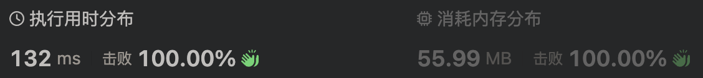
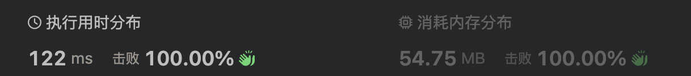

# 2516. 每种字符至少取 K 个

给你一个由字符 'a'、'b'、'c' 组成的字符串 s 和一个非负整数 k 。每分钟，你可以选择取走 s 最左侧 还是 最右侧 的那个字符。

你必取走每种字须符 至少 k 个，返回需要的 最少 分钟数；如果无法取到，则返回 -1 。

示例 1：

> 输入：s = "aabaaaacaabc", k = 2
> 输出：8
>
> 解释：
> 从 s 的左侧取三个字符，现在共取到两个字符 'a' 、一个字符 'b' 。
> 从 s 的右侧取五个字符，现在共取到四个字符 'a' 、两个字符 'b' 和两个字符 'c' 。
> 共需要 3 + 5 = 8 分钟。
> 可以证明需要的最少分钟数是 8 。

示例 2：

> 输入：s = "a", k = 1
>
> 输出：-1
>
> 解释：无法取到一个字符 'b' 或者 'c'，所以返回 -1 。

提示：

- 1 <= s.length <= 105
- s 仅由字母 'a'、'b'、'c' 组成
- 0 <= k <= s.length

## 方法一：滑动窗口

## 思路

由于只能从左侧或者右侧取数，abc 字符出现的次数必须大于 k，并不能保证取到字符串刚好是 3\*k 个。

分三次计算

一、从左往右取 [0 ~ len-1]，满足 abc 都大于等于 k 时退出循环
二、从右往左取 [len-1 ~ 0]，满足 abc 都大于等于 k 时退出循环
三、从 left = len - 3 \* k 处往右取，取到 len + left 处结束，[left, len + left]

在环形取数时，最小的位数即是 3\* k，当 map[s[left]] > k，说明后面取的字符在窗口的第一位已经出现过了，因此删除字符 left++，每当满足 abc 都大于等于 k 时取一次 res 的最小值

## 疑惑

即是是通过的 leetcode 的测试用例，其实我还是有一点疑惑的

一、从 len - 3 \* k 处开始取值，其实也不能保证会不会往左移动会减少总数的个数
二、感觉这样的方法其实是多判断的一些次数的，但 leetcode 莫名其妙的击败了 100%，可能是用 ts 做这题的很少吧



三、其实在从左或从右的遍历之后，都可以进行边缘判断，如果已经满足最小值 3 \* k 就可以返回了。

## 代码

```ts
function takeCharacters(s: string, k: number): number {
  if (k == 0) return 0;

  const len = s.length;
  let map: Record<string, number> = { a: 0, b: 0, c: 0 };
  let res = Infinity;
  let left = len - 3 * k;
  if (left < 0) return -1;

  for (let i = 0; i < len; i++) {
    map[s[i]]++;
    if (map.a >= k && map.b >= k && k && map.c >= k) {
      res = Math.min(res, i + 1);
      break;
    }
  }
  map = { a: 0, b: 0, c: 0 };
  // 满足最小值
  if (res == 3 * k) return res;

  for (let i = len - 1; i >= 0; i--) {
    map[s[i]]++;
    if (map.a >= k && map.b >= k && k && map.c >= k) {
      res = Math.min(res, len - i);
      break;
    }
  }

  map = { a: 0, b: 0, c: 0 };
  // 满足最小值
  if (res == 3 * k) return res;

  for (let i = left; i < len + left; i++) {
    map[s[i % len]]++;

    // s[left]多余
    while (map[s[left]] > k) {
      map[s[left]]--;
      left++;
    }

    if (map.a >= k && map.b >= k && k && map.c >= k) {
      res = Math.min(res, i - left + 1);
    }
  }

  if (res === Infinity) return -1;
  return res;
}
```

## 方法二：双指针

## 思路

设从左侧取到第 i 个字符，从右侧取到第 j 个字符。

由于随着 i 的变大，j 也会单调变大，因此可以用双指针，一边从小到大枚举 i，一边维护 j 的最大位置（j 尽量向右移）。

对于左侧没有取字符的情况需要单独计算。

[作者：灵茶山艾府](https://leetcode.cn/problems/take-k-of-each-character-from-left-and-right/solutions/2031995/on-shuang-zhi-zhen-by-endlesscheng-4g9p/)

## 分析

他的方法在于他先从尾部一直取到 abc 满足大于等于 k 的条件，找到了右边的基准点，也就是我的解法中我疑惑的点：len - 3 \* k 这个位置并不能保证是取完末尾的 3\*k 张再从头取是最小数量，也许尾部再往左取一些更好。所以导致一些用例无法通过，而提前做了左右两边的操作后，就能保证从左侧或者右侧取不到最小值，因此必须左右都取值。

而现在先将尾部取到满足条件，再去将 right 基准点尽量向右移动，从左边取更少的数来补充使其满足条件。直到 right == len 也就是右边的值已经完全删除，最小值需要完全从左侧取到。

我的方法问题在于左右取元素时的边缘问题，我无法达成最小值完全从左侧或右侧取到的条件。

他的方法优先找到了一个窗口长度，可能是最长也可能最短，不确定，在此基础上进行左右可能不对等的滑动，来找到长度最小值。

而我一开始的窗口长度被我固定为 3 \* k ，这本身就不是一个有可信度的值，而终点又是从此处滑动到 len + 3 \* k，因此某个特殊值 [x ~ 3 \* k] 是否存在更小值是无法计算到的。

从 leetcode 的时间来看，差别不是很大



## 代码

```ts
function takeCharacters(s: string, k: number): number {
  let map: Record<string, number> = { a: 0, b: 0, c: 0 };
  let len = s.length;
  let right = len;
  let res = Infinity;

  while (map.a < k || map.b < k || map.c < k) {
    // 遍历结束还是不满足abc能大于等于k，返回-1
    if (right == 0) return -1;
    right--;
    map[s[right]]++;
  }
  res = len - right;

  for (let left = 0; left < len; left++) {
    map[s[left]]++;
    while (map[s[right]] > k) {
      map[s[right]]--;
      right++;
    }
    res = Math.min(res, left + 1 + len - right);
    if (right == len) break;
  }
  return res;
}
```
