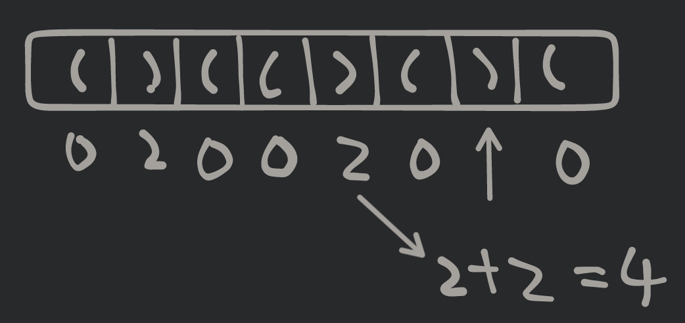

# 32. 最长有效括号

给你一个只包含 '(' 和 ')' 的字符串，找出最长有效（格式正确且连续）括号子串的长度。

- 示例 1：

```
输入：s = "(()"
输出：2
解释：最长有效括号子串是 "()"
```

- 示例 2：

```
输入：s = ")()())"
输出：4
解释：最长有效括号子串是 "()()"
```

- 示例 3：

```
输入：s = ""
输出：0
```

- 提示：

```
0 <= s.length <= 3 \* 104
s[i] 为 '(' 或 ')'
```

## 解答

### 动态规划

遇到 **"("** 入栈，遇 **")"** 出栈，栈记录字符的下标；再用一个数组记录对应位置的字符能够构成的最大有效括号。

> 如何记录当前位置出的最大有效括号数：

当前位置的有效括号数=前一个字符的有效括号数+栈顶元素位置的有效括号数+2，即： **dp[i] = dp[i-1] + dp[top-1] + 2**

- 分析：



```ts
export function longestValidParentheses(s: string): number {
  if (s.length <= 1) return 0;
  const stack: number[] = [];
  const sum: number[] = [];
  for (let i = 0; i < s.length; i++) {
    if (s[i] === "(") {
      stack.push(i);
      sum[i] = 0;
    } else if (s[i] === ")") {
      const top = stack.pop();
      if (top !== undefined) {
        sum[i] = (sum[top - 1] || 0) + (sum[i - 1] || 0) + 2;
      } else {
        sum[i] = 0;
      }
    }
  }
  return Math.max(...sum);
}
```

### 左右扫描

遍历字符串，记录遇到的左括号和右括号；当左右括号数量相等时，记录有效括号数。

当从左遍历时，若右括号数大于左括号数，则将记录的括号数清零；

> 因为从左边开始，当右括号多的时候，就表示没有左括号能和它匹配，即有效括号到此处结束，后面得重新开始匹配。

当从右遍历时，若左括号数大于右括号数，则将记录的括号数清零；

> 右边同理，左括号多时表示找不到右括号匹配了。

```ts
export function longestValidParentheses1(s: string): number {
  let left = 0,
    right = 0,
    max = 0;
  for (let i = 0; i < s.length; i++) {
    fn(i);
    if (right > left) em();
  }
  em();
  for (let i = s.length - 1; i >= 0; i--) {
    fn(i);
    if (left > right) em();
  }

  function fn(i: number) {
    if (s[i] === "(") {
      left++;
    } else {
      right++;
    }
    if (left === right) {
      max = Math.max(left * 2, max);
    }
  }
}
```
