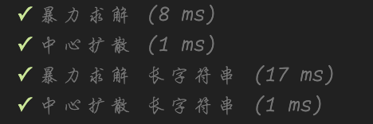

# 5. 最长回文子串

## 题目

给你一个字符串 s，找到 s 中最长的回文子串。

- 示例 1：

```
输入：s = "babad"
输出："bab"
解释："aba" 同样是符合题意的答案。
```

- 示例 2：

```
输入：s = "cbbd"
输出："bb"
```

- 提示：

```
1 <= s.length <= 1000
s 仅由数字和英文字母组成
```

---

## 解法

### 暴力求解

[代码地址](https://github.com/shellingfordly/algorithms/blob/master/src/5_longestPalindrome/longestPalindrome.ts)

[测试代码](https://github.com/shellingfordly/algorithms/blob/master/src/5_longestPalindrome/longestPalindrome.spec.ts)

- 判断是否是回文串

```ts
function isPalindrome(s: string): boolean {
  let l = 0;
  let r = s.length - 1;
  while (l < r) {
    if (s[l] === s[r]) {
      l++;
      r--;
    } else {
      return false;
    }
  }
  return true;
}
```

直接获取每个字符子串判断是否为回文串，最后输出最长子串

用数组保存回文子串，下标为长度，最后输出最后一个（比较占内存）

```ts
export function longestPalindrome(s: string): string {
  const arr = [""];
  for (let i = 0; i < s.length; i++) {
    for (let j = i + 1; j <= s.length; j++) {
      const value = s.slice(i, j);
      if (isPalindrome(value)) {
        arr[value.length] = value;
      }
    }
  }
  return arr.pop()!;
}
```

暴力求解的方式在字符串很长的时候就慢了一些，需要 17ms


- 优化

增加一个变量记录上一次的回文串长度，如果比之前的短就不做回文判断了

```ts
export function longestPalindrome(s: string): string {
  const arr = [""];
  let maxLen = 0;
  for (let i = 0; i < s.length; i++) {
    for (let j = i + 1; j <= s.length; j++) {
      const value = s.slice(i, j);
      if (j - i < maxLen) continue;
      if (isPalindrome(value)) {
        maxLen = value.length;
        arr[value.length] = value;
      }
    }
  }
  return arr.pop()!;
}
```

优化过后快了一点，17ms 变成了 10ms，感知不是很强烈


但是如果`isPalindrome`的操作比较复杂的话，就会明显一些

我们把 isPalindrome 的时间拉长一点

```ts
function isPalindrome(s: string): boolean {
  const reverseStr = s.split("").reverse().join("");
  return s === reverseStr;
}
```

差距就出现了，增加了变量减少了判断，节省了 isPalindrome 花费的时间


---

### 中心扩散

> 以一个字符为中，向两边扩散，获取它左边一个字符和右边一个字符判断是否相等；相等则为回文串，继续扩散。

然后从第一个字符开始，查询出它的最大回文字符串，再与记录上一次子串对比，返回最长的子串；

需要两次`palindrome`是因为从一个字符扩散只包含了单数长度的回文串，因此还需增加两个字符为中心的扩散方式。

```ts
export function longestPalindrome(s: string): string {
  let res = "";

  for (let i = 0; i < s.length; i++) {
    // 单数回文串
    const s1 = palindrome(s, i, i);
    // 双数回文串
    const s2 = palindrome(s, i, i + 1);

    res = s1.length > res.length ? s1 : res;
    res = s2.length > res.length ? s2 : res;
  }

  function palindrome(s: string, l: number, r: number): string {
    while (l >= 0 && r < s.length && s.charAt(l) === s.charAt(r)) {
      l--;
      r++;
    }
    return s.substring(l + 1, r);
  }

  return res;
}
```

使用中心扩散的方式就快了很多，即使是优化过后的暴力求解，也拉开了很大的差距


